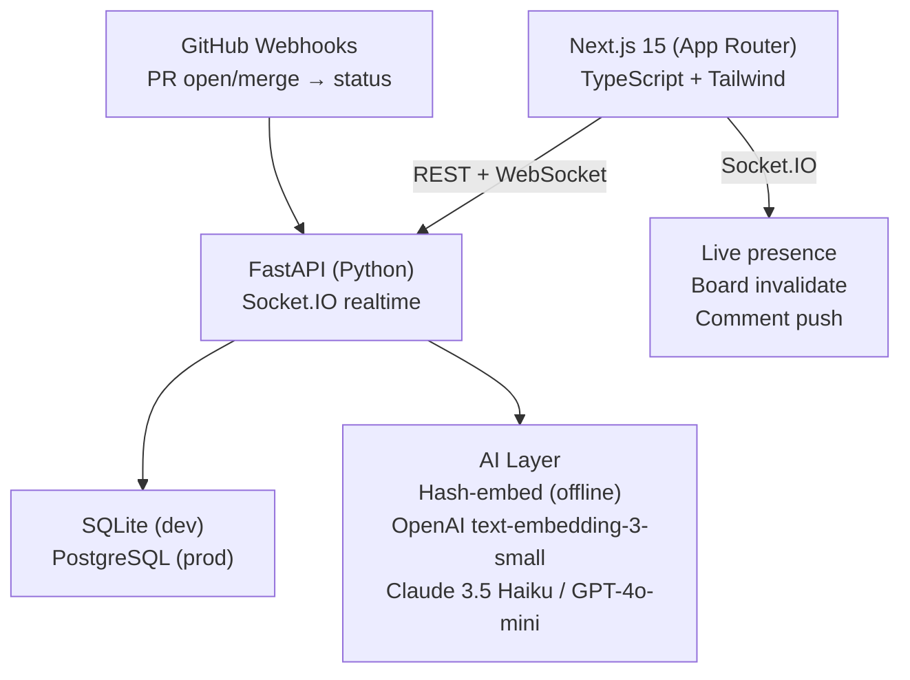

# NexusTrack

> **Reimagining Bugzilla for 2026** — Bugzilla's rigor + Linear's UX + AI-native triage + git-native workflow.

We deconstructed Bugzilla into five core jobs-to-be-done (**capture, route, track, collaborate, query**), kept the rigor that makes it enterprise-grade (structured lifecycle, full audit trail, powerful Boolean queries), and rebuilt the three areas where it visibly fails modern teams: **triage** (AI-assisted), **collaboration** (real-time), and **developer integration** (git-native workflow).

---

## Architecture



## Stack

| Layer | Choice |
|---|---|
| Frontend | Next.js 15 (App Router), TypeScript, Tailwind v4 |
| Realtime | Socket.IO (python-socketio + ASGI) |
| Backend | FastAPI + SQLAlchemy 2 + SQLite/PostgreSQL |
| AI | Hash-embed (offline) → OpenAI `text-embedding-3-small` / Anthropic Claude |
| Auth | JWT (python-jose) + RBAC (5 roles) |
| File storage | Local filesystem (production: S3/MinIO) |

---

## Quick Start

### Backend

```bash
cd backend
pip install -r requirements.txt
python run.py
# → http://127.0.0.1:8000  (API docs at /docs)
# Database seeds on first run — no setup needed
```

**Demo credentials** (seeded automatically):

| Email | Password | Role |
|---|---|---|
| `maya@nexustrack.dev` | `demo1234` | Admin |
| `priya@nexustrack.dev` | `demo1234` | Developer |
| `sofia@nexustrack.dev` | `demo1234` | Reporter |

### Frontend

```bash
cd frontend
npm install
npm run dev
# → http://localhost:3000
```

### Environment (optional)

```bash
# backend/.env
OPENAI_API_KEY=sk-...          # enables real embeddings + GPT-4o-mini summaries
ANTHROPIC_API_KEY=sk-ant-...   # enables Claude 3.5 Haiku summaries
GITHUB_WEBHOOK_SECRET=...      # for real GitHub webhook HMAC verification
```

Without API keys, the system falls back to a deterministic hash-embedding (offline) and extractive summaries — the AI features remain fully demonstrable.

---

## Feature Highlights

### Core (Bugzilla parity + improvements)

- **Structured lifecycle** — `NEW → TRIAGED → IN_PROGRESS → IN_REVIEW → RESOLVED → VERIFIED → CLOSED`, enforced server-side. Illegal transitions return HTTP 409.
- **Full audit trail** — immutable `StatusHistory` table, readable in the "Audit trail" tab of every issue
- **Role-based access control** — Admin / Maintainer / Developer / Reporter / Guest, enforced at the query layer (private comments genuinely hidden server-side)
- **Kanban board** — drag-and-drop status changes with real-time board updates via WebSocket
- **Visual query builder** — AND/OR rule groups replace Bugzilla's Boolean Charts; queries are saveable and shareable as URLs
- **SLA tracking** — per-severity response/resolution hour thresholds, breach badges on cards and dashboard
- **Dependency graph** — blocks / related / duplicates as interactive SVG with arrowheads, hover tooltips, edge-type filtering

### Innovation Layer

#### AI Triage
- **Semantic duplicate detection** — every new issue is embedded (OpenAI or hash-fallback); cosine similarity ≥ 0.42 surfaces candidates *before filing*
- **Severity/priority suggestion** — keyword heuristic + confidence score shown in the triage panel
- **Smart assignee routing** — suggests the user who has historically resolved similar issues fastest
- **Thread TL;DR** — LLM (Claude/GPT-4o-mini) or extractive fallback summarizes long comment threads to 2 sentences

#### Real-Time Collaboration
- **Live presence** — see avatars of other users viewing the same issue
- **Typing indicators** — "Priya is typing…" appears in the comment thread
- **Board live updates** — dragging a card on one browser instantly updates all others

#### Developer Workflow Integration
- **GitHub webhook** — `Fixes #N` in a PR title/body auto-transitions the issue to `IN_REVIEW` on open, `RESOLVED` on merge
- **CI status badge** — check suite conclusion (`success` / `failure` / `pending`) displayed on the issue card
- **Demo merge button** — simulates a GitHub PR merge for live demos without needing a real repo

### Analytics & Reporting (Bugzilla's weakest area, rebuilt)
- Animated KPI cards (open issues, MTTR, 7-day velocity)
- SVG trend chart — opened vs closed per day (14d) with hover tooltips
- Stacked CFD — cumulative flow diagram by status (14d)
- Severity donut chart
- Reporter leaderboard
- CSV export

---

## Demo Script (3-minute walkthrough)

1. **Login** as `maya@nexustrack.dev` / `demo1234`
2. **Board** — drag NT-1 from `IN_PROGRESS` to `IN_REVIEW` — watch it animate
3. **New issue** — type "Login creates duplicate sessions" → AI panel suggests `blocker`, flags NT-1 and NT-2 as duplicates with similarity scores
4. **Issue NT-8** — click "Generate thread TL;DR" → AI summary appears
5. **Issue NT-8** — click "Simulate GitHub Fixes # merge" → status transitions to `RESOLVED`, audit trail updates, dashboard velocity ticks up
6. **Dashboard** — hover bars for tooltips, MTTR counter, CFD
7. **Query builder** — build "P0/P1 open blockers", save & share
8. **Graph** — hover nodes to see dependency edges light up

---

## Security Notes

- RBAC enforced **server-side** on every mutation (not just UI-hidden)
- Private/internal comments filtered at the query layer
- Rate limiting via `slowapi`
- Markdown rendered via `markdown-it-py` + `bleach` sanitization (no raw HTML injection)
- JWT short-lived tokens (12h) + `Authorization: Bearer` header
- File uploads: type + size validated server-side, MIME checked
- HMAC verification on GitHub webhook payloads
- Security headers (`X-Content-Type-Options`, `X-Frame-Options`, `Referrer-Policy`) via middleware

---

## Project Structure

```
bugzilla/
├── backend/
│   ├── app/
│   │   ├── models.py          # 13 SQLAlchemy entities
│   │   ├── routers/           # 10 FastAPI routers
│   │   │   ├── issues.py      # CRUD + status machine + comments
│   │   │   ├── ai.py          # triage, summarize, re-embed
│   │   │   ├── dashboard.py   # analytics + CSV export
│   │   │   ├── github.py      # webhook + demo-merge
│   │   │   └── search.py      # Boolean query engine + saved queries
│   │   ├── services/
│   │   │   ├── ai.py          # embeddings, duplicate detection, LLM
│   │   │   ├── state_machine.py # lifecycle enforcement
│   │   │   └── sla.py         # SLA computation
│   │   ├── realtime.py        # Socket.IO presence + rooms
│   │   └── seed.py            # 15 realistic demo issues
│   └── requirements.txt
└── frontend/
    └── src/
        ├── app/
        │   ├── dashboard/     # analytics page
        │   ├── board/         # Kanban
        │   ├── issues/        # list + detail + new
        │   ├── search/        # query builder
        │   └── graph/         # dependency graph
        └── components/
            ├── Shell.tsx      # layout + nav + notifications
            ├── Badges.tsx     # StatusBadge, SeverityBadge, etc.
            └── CommandPalette.tsx
```
